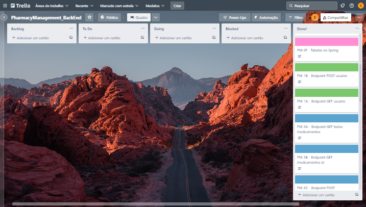

# M2P2 - PharmacyManagement

Para rodar o programa localmente, e com a devida interação com o banco de dados, você precisa ter instalado no computador:
- IntelliJ;
- PostegreSQL; e
- Postman.

### Passo a passo

- Depois de clonar o repositório em seu computador, você precisará abrir o projeto no IntelliJ e seguir o seguinte caminho:

```
src / main / resources / application.properties 
```

- No arquivo application.properties, inserir o  comando:

```
spring.datasource.url=jdbc:postgresql://localhost:5432/pharmacy_management
spring.datasource.port=5432
spring.datasource.username=postgres
spring.datasource.password=
spring.datasource.driver-class-name=org.postgresql.Driver

spring.jpa.show-sql=true
spring.jpa.hibernate.ddl-auto=update
spring.jpa.properties.hibernate.dialect=org.hibernate.dialect.PostgreSQLDialect
spring.jpa.properties.hibernate.globally_quoted_identifiers=true

spring.datasource.testWhileIdle=true
spring.datasource.validationQuery=SELECT 1
```
Obs.: o campo "password" deve ser preenchido com a senha do seu banco de dados Postgres.

- No Postgres, criar o databases com o nome "pharmacy_management", da seguinte forma:

```
Servers / clicar com botão direito em PostgreSQL15 / Create / Database / pharmacy_management / Save
```

- Novamente no IntelliJ, clicar em RUN.

- Por fim, usar o PostMan para fazer as requisições nos endpoints:
```
http://localhost:8080/usuario/cadastro
http://localhost:8080/usuario/login

http://localhost:8080/farmacia

http://localhost:8080/medicamentos
```
&nbsp;

---
#### Informações complementares - Sobre o desenvolvimento do projeto
Neste projeto foram utilizadas as ferramentas Trello e Drawio para organizar as etapas de desenvolvimento do projeto e visualizar a organização do banco de dados, respectivamente.


[Trello](https://trello.com/b/VMCor83z/pharmacymanagementbackend)


[Drawio](https://drive.google.com/file/d/16DTkpefeRqkkEpwj-svt6Camavlo-DEa/view?usp=sharing)
